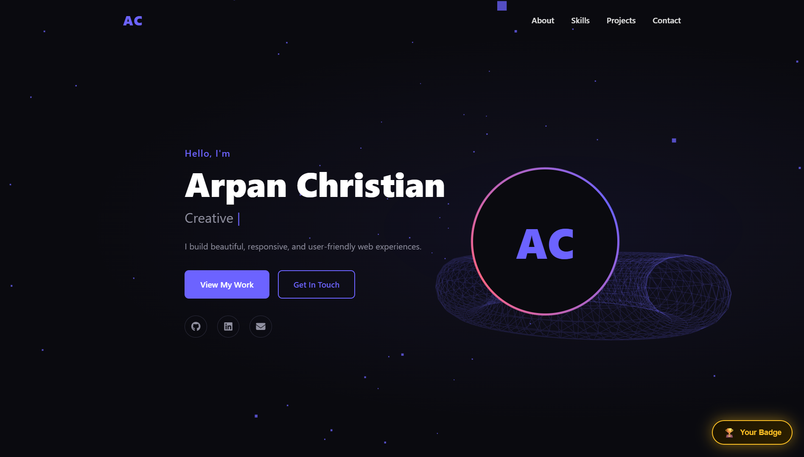

<div align="center">

# ✨ Arpan Christian — Personal Portfolio

### *Web Developer · Cybersecurity Enthusiast · Creative Coder*

[](https://arpanchristian2507.github.io/)
[](https://github.com/Arpanchristian2507)
[](https://linkedin.com/in/arpan-christian-25072005t315/)
[](mailto:arpanchristian2507@gmail.com)

---

> 🚀 **A portfolio that goes beyond a simple web page — it's an experience.**

</div>

---

## 🖥️ Preview



> *The hero section features a live 3D particle field and an animated wireframe torus powered by Three.js. Every scroll reveals something new.*

---

## ✨ What Makes This Portfolio Stand Out?

This isn't your average portfolio. It's packed with details that reward the curious:

| Feature | Description |
|---|---|
| 🌌 **3D Hero Background** | A live, interactive particle field + wireframe torus rendered with **Three.js**, reacting to your mouse movement |
| ⚡ **GSAP Scroll Animations** | Buttery-smooth entrance animations on every section as you scroll |
| ⌨️ **Typing Effect** | Cycles through roles — *Web Developer, Cybersecurity Enthusiast, UI/UX Enthusiast, Creative Coder* |
| 📊 **Animated Skill Bars** | Skill bars animate into view when you scroll to them |
| 🔢 **Live Stat Counters** | Stats count up dramatically as they enter the viewport |
| 📱 **Fully Responsive** | Looks great on every screen, from mobile to widescreen |
| 🔐 **Hidden CTF Challenge** | A multi-stage Capture The Flag puzzle hidden inside the site — *can you find it?* |
| 🏆 **Achievement Badge** | Solve all stages of the CTF and earn a persistent digital badge saved in your browser |
| 📬 **Contact Form** | Client-side validated contact form built right in |

---

## 🕵️ Secret: The Hidden CTF Challenge

> *"There is more to this website than it looks! Open the console to inspect."*

Hidden within the portfolio is a **multi-stage Capture The Flag (CTF) puzzle** designed for developers, security enthusiasts, and curious minds. It involves:

- 🔍 **Inspecting source code** for encoded clues
- 🔓 **Decoding Base64** messages in the browser console
- 🧠 **Solving logic puzzles** across multiple stages
- 🏆 **Unlocking a secret page** and earning a permanent digital badge

*No brute force. No guessing. Just logic.*

**Hint:** Start by opening DevTools (F12) and checking the Console tab...

---

## 🛠️ Tech Stack

<div align="center">


</div>

---

## 💼 Skills

```
Frontend
  ├── HTML5              ████████████████████░░  90%
  ├── CSS3               ███████████████████░░░  85%
  └── JavaScript         ██████████████████░░░░  80%

Tools & Others
  ├── Git & GitHub       ███████████████████░░░  85%
  ├── Responsive Design  ████████████████████░░  88%
  └── UI / UX            █████████████████░░░░░  75%
```

---

## 🗂️ Featured Projects

### 🖥️ Portfolio Website
> A responsive personal portfolio built with HTML, CSS, and JavaScript — the very site you're looking at.
- **Tags:** `HTML` `CSS` `JavaScript` `Three.js` `GSAP`
- 🔗 [Live Demo](https://arpanchristian2507.github.io/) · [Source Code](https://github.com/Arpanchristian2507/Portfolio)

### 🎨 UI Design System
> A comprehensive collection of reusable UI components with consistent styling and interactions.
- **Tags:** `CSS` `Design`

### 📱 Responsive Landing Page
> A modern, fully responsive landing page with animations and smooth scrolling effects.
- **Tags:** `HTML` `CSS` `JavaScript`

---

## 📬 Get In Touch

I'm currently **open to new opportunities**. Whether you have a project idea, a question, or just want to say hi — I'd love to hear from you!

| | |
|---|---|
| 📧 **Email** | [arpanchristian2507@gmail.com](mailto:arpanchristian2507@gmail.com) |
| 💼 **LinkedIn** | [linkedin.com/in/arpan-christian-25072005t315](https://linkedin.com/in/arpan-christian-25072005t315/) |
| 🐙 **GitHub** | [github.com/Arpanchristian2507](https://github.com/Arpanchristian2507) |
| 📍 **Location** | Winnipeg, MB |

---

<div align="center">

**⭐ If you enjoyed exploring this portfolio, consider leaving a star on the repo!**

*Made with ❤️ and lots of ☕ by Arpan Christian*

</div>